# Simple Restaurant

Program Restoran sederhana dilengkapi dengan login dan register user.

## Deskripsi Singkat

Pada program restoran yang saya buat ini terintegrasi dengan file .txt sebagai database untuk menyimpan beberapa data diantaranya data user, dan data makanan. Beberapa fitur lainnya:

-   User dapat melakukan registrasi, dengan menginputkan username dan password.
-   User dapat melakukan login dari data yang sudah teregistrasi.
-   Mode Admin untuk menambahkan, mengupdate, membaca, dan menghapus makanan/minuman pada database
-   User dapat membuat pesanan dari produk makanan/minuman yang tersedia.
-   Dapat memunculkan tagihan dan harga total sesuai dengan pesanan user.
-   User dapat menginputkan cash sebagai metode pembayaran.
-   Menampilkan total uang kembali jika user menginputkan cash lebih dari tagihan.
-   Program akan terus berjalan dengan berbagai pilihan menu yang menarik.
-   Program akan berhenti jika user memilih menu exit program.

## Dokumentasi

#### Halaman Awal Saat Program diajalankan

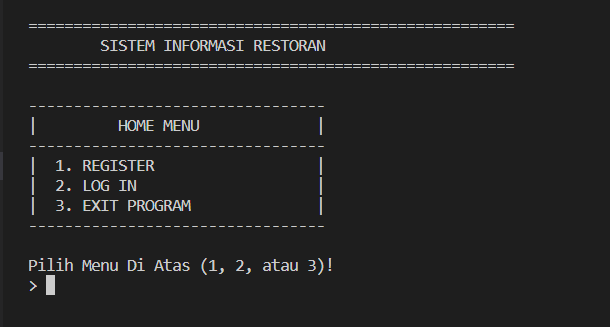

#### Register

Input Username & Password
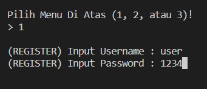

Register Sukses
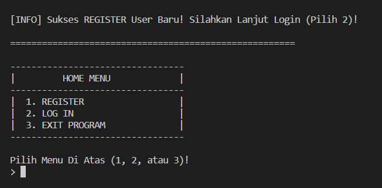

#### Login

Input username & password, jika sukses maka akan tampil **Menu Utama** dibawah ini
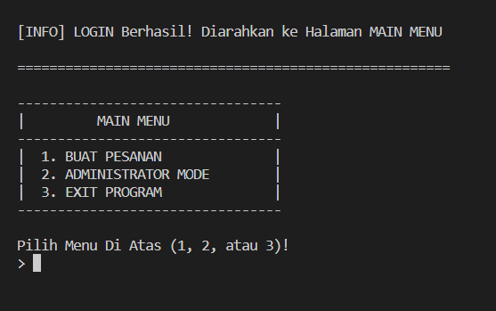

#### Administrator Mode

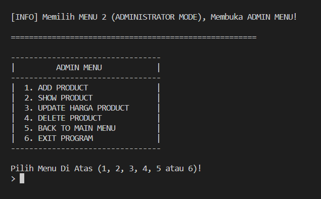

-   **Menambahkan Produk**
    Input Nama & Harga.
    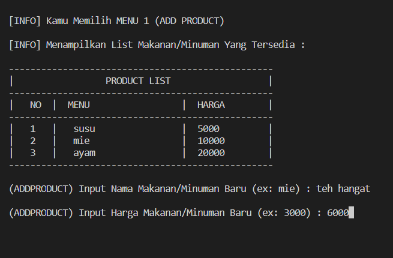

-   **Show Produk**
    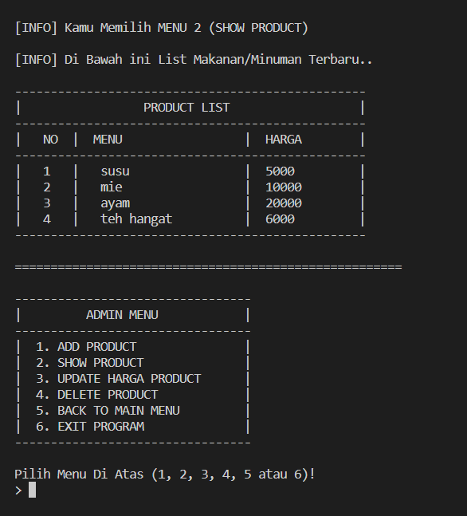

-   **Update Produk**
    Input nama produk yang ingin diperbarui.
    dan Input Harga terbarunya.
    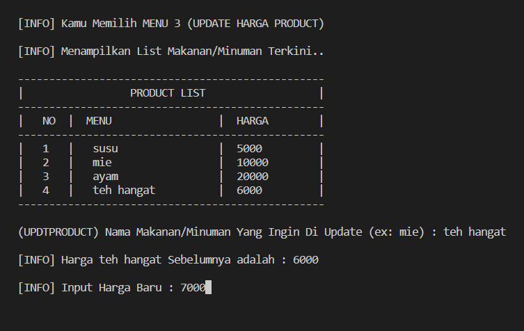

-   **Delete Produk**
    Input nama produk yang ingin dihapus.
    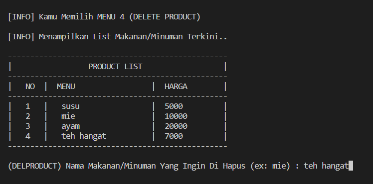

#### Membuat Pesanan

Input nama produk yang diinginkan beserta dengan jumlahnya.
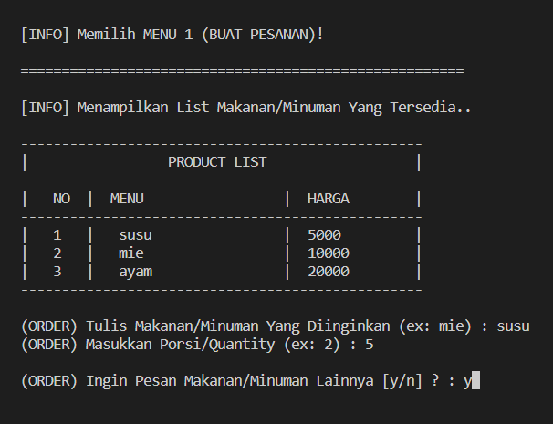

-   **Invoice**
    Jika input **no** pada pilihan diatas, maka akan menampilkan tagihan user.
    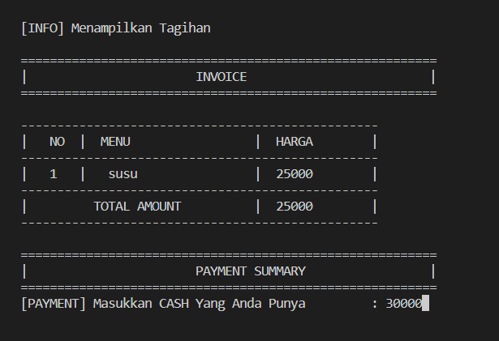

-   **Payment**
    Jika input **CASH** lebih dari sama dengan total tagihan, maka tampilan sebagai berikut
    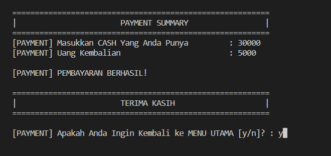
